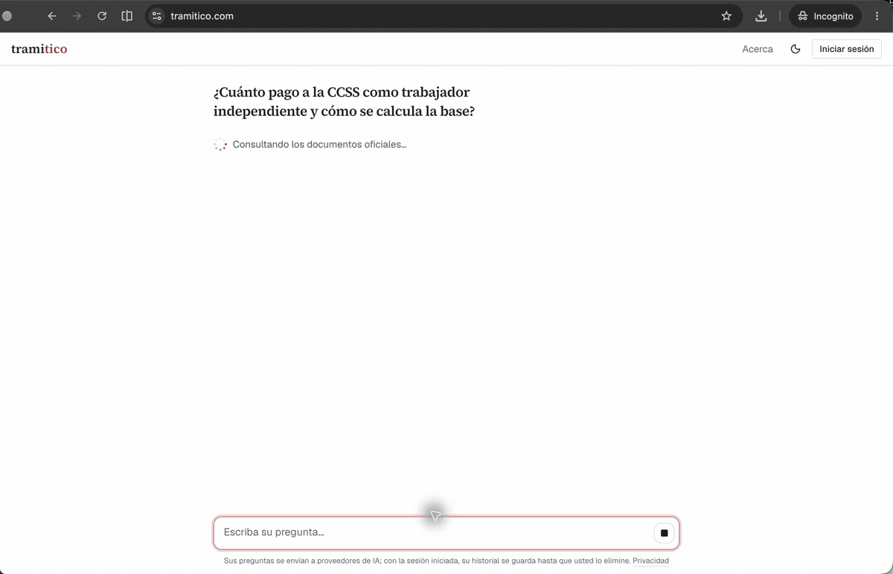
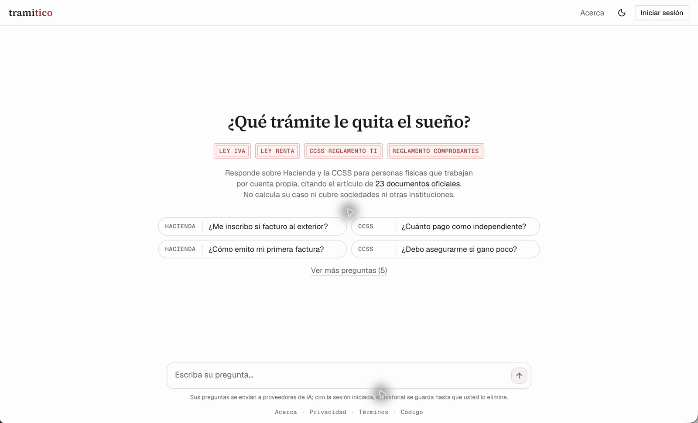
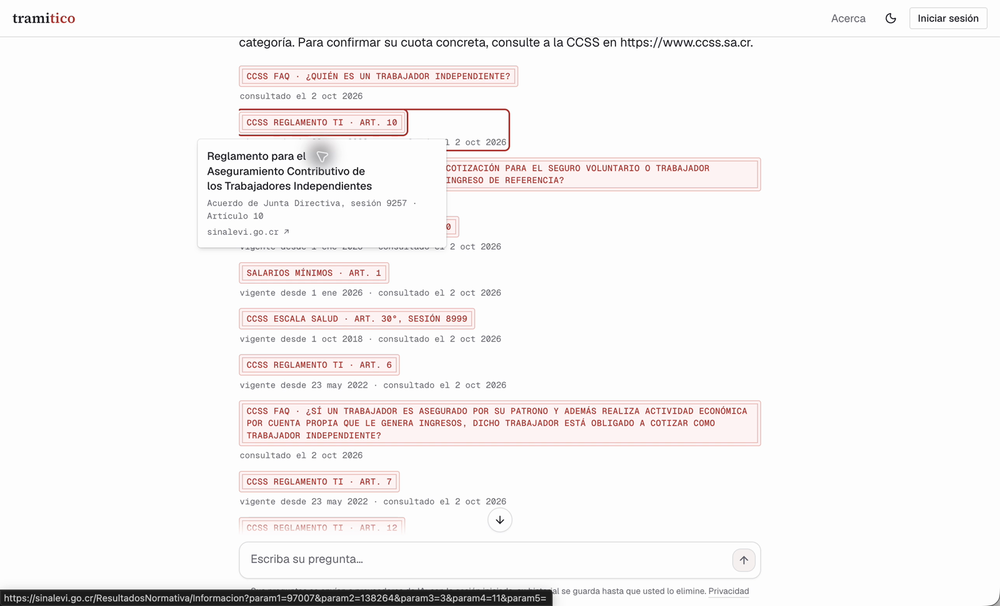
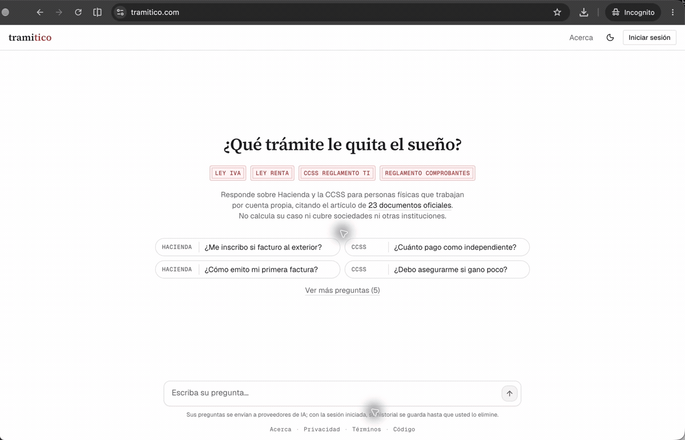
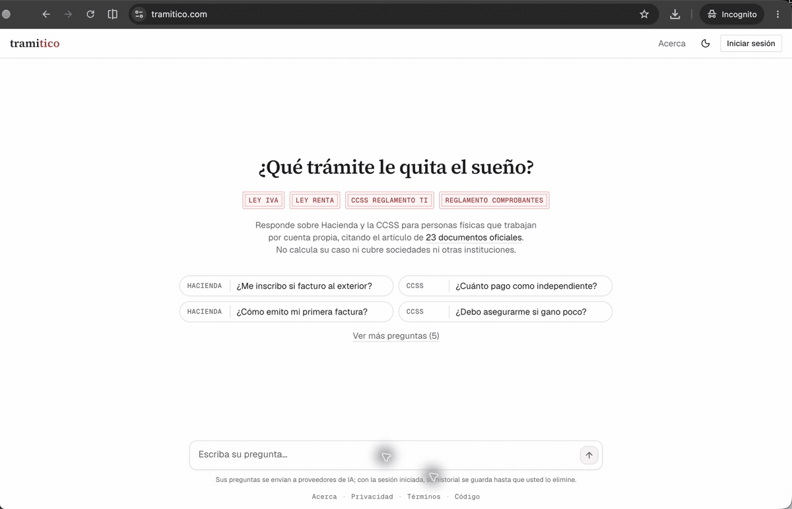
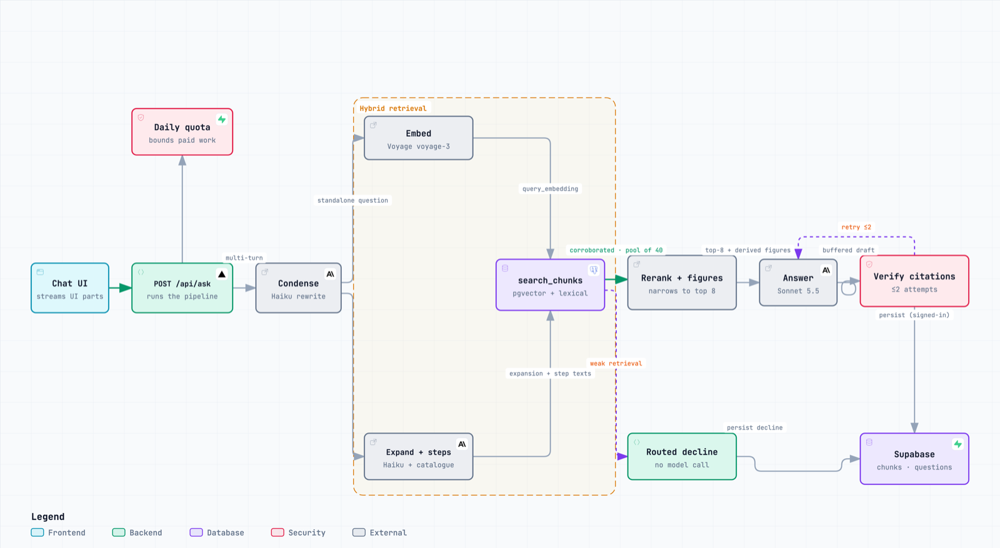

# Tramitico

[](https://github.com/rjwrld/tramitico/actions/workflows/ci.yml)
[](LICENSE)

A RAG assistant that answers the tax and social-security questions of people who work for
themselves in Costa Rica, in plain Spanish, with every material claim cited to the official
Hacienda or CCSS document it came from. It retrieves and cites; it never rules. When the
corpus cannot back an answer it says so, and when the question belongs to another institution
it names that institution instead of guessing. The app is in Spanish because its users are;
this README is in English because its second audience reads code. _Tramitico_ is a diminutive
of _trámite_, the Costa Rican word for paperwork.

**Live:** [tramitico.com](https://tramitico.com).



<sub>Recorded on the live app on October 6, 2026, in an anonymous session. Processing waits, idle pauses and source-page loading are shortened; shortened waits are marked “Espera abreviada”. The answer reveal plays at normal speed.</sub>

<details>
<summary>See the current interface</summary>





</details>

## What it does

- **Answers from the source, not from memory.** Every figure, deadline and condition in an
  answer carries a seal that opens the official document and artículo it was taken from. An
  answer with a citation that does not resolve is never shown; the pipeline retries once and
  then declines ([ADR 0011](docs/adr/0011-runtime-citation-invariant.md)).
- **Says no when it should.** A question the corpus does not cover gets an honest abstention.
  A question for another institution, immigration, municipal patentes, INS, gets a decline
  that names the institution and links its page
  ([ADR 0017](docs/adr/0017-other-institutions-are-routed.md)).

  <details>
  <summary>Watch a question routed to Migración</summary>

  

  </details>

  <details>
  <summary>Watch a future-rate question declined</summary>

  

  The app declines to predict the 2027 rate, then adds information about current rates.

  </details>

- **Never invents a number.** Figures that no single document states, such as the CCSS
  minimum contribution base, are computed by code from cited inputs, never by the model
  ([ADR 0018](docs/adr/0018-derived-figures-by-code.md)).
- **Remembers the thread.** Follow-up questions are condensed into one standalone question
  before retrieval, so «¿y si facturo desde España?» is searched as the full question it
  implies ([ADR 0012](docs/adr/0012-multi-turn-question-condensation.md)).

## How it answers



<sub>Rendered from [`docs/assets/ask-pipeline.architecture.json`](docs/assets/ask-pipeline.architecture.json); every node cites the file and line it describes at a pinned commit.</sub>

One request, left to right: a daily quota check, condensation of the conversation into one
question, hybrid retrieval, a rerank, one model call, a citation check, and persistence.

- **Retrieval is hybrid and asks the question more than once.** The question, a
  corpus-register rewrite of it ([ADR 0019](docs/adr/0019-query-expansion-legs.md)) and, for
  the families that have one, the hand-written steps a complete answer needs
  ([ADR 0020](docs/adr/0020-step-catalogue-legs.md)) each run a vector leg and a lexical leg
  inside one Postgres function. Reciprocal rank fusion merges them into a pool of 40; a
  reranker keeps 8.
- **The answer is checked before it is streamed.** The model writes with numbered markers;
  the server buffers the answer, resolves every marker to a retrieved chunk, and only then
  streams it with the seals attached.
- **Everything that spends is bounded.** The quota is checked before any provider call and
  refunded on any failure that is not the user's
  ([ADR 0013](docs/adr/0013-disconnect-refunds-and-internal-deadline.md)). The pipeline
  carries its own deadline so the platform never kills it mid-answer.

Models: `claude-sonnet-5-5` writes the answer, `claude-haiku-5-5` condenses and expands,
Voyage `voyage-3` embeds and `rerank-2.5-lite` reranks. Postgres with pgvector holds the
corpus, the question history and the quota, all behind row-level security.

## The numbers

The corpus is 23 official documents in 873 chunks. The eval set those runs read is 73
hand-written cases, each with the artículo the answer must cite and, for the 40 that carry
them, the claims a complete answer must make. Every case is run through the production
pipeline and judged by a second model at temperature 0. The table carries the three full
runs since the pipeline was frozen: the closing run of 2026-09-11
([`eval/runs/2026-09-11-closing/`](eval/runs/2026-09-11-closing/)), the record run of
2026-09-15 that measured the last knob and left it where it was
([`eval/runs/2026-09-15-top-k/`](eval/runs/2026-09-15-top-k/)), and the first run against
the deployed stack on 2026-09-16, executed by the eval workflow on GitHub Actions
([`eval/runs/2026-09-16-production/`](eval/runs/2026-09-16-production/)).

| Gate                                            | Baseline (2026-09-05) | Closing run (2026-09-11) | Record (2026-09-15) | Production (2026-09-16) | Gate today                                     |
| ----------------------------------------------- | --------------------- | ------------------------ | ------------------- | ----------------------- | ---------------------------------------------- |
| Retrieval hit-rate (cited artículo in top 8)    | 63/73                 | 70/73                    | 72/73               | **70/73**               | ≥ 0.92                                         |
| Groundedness (answer supported by its chunks)   | 70/73                 | 70/73                    | 69/73               | **69/73**               | baseline 68 answers; fails at ≤ 63             |
| Adequacy, Tier 2 (every required claim present) | 9/13                  | 12/13                    | 10/13               | **12/13**               | ≥ 0.84                                         |
| Abstention (declines when it should)            | 4/7                   | 9/9                      | 9/9                 | **8/9**                 | ≥ 0.90                                         |
| Adequacy, Tier 1 (every required claim present) | —                     | 5/27                     | 3/27                | **6/27**                | reported; the gate counts requirements (below) |
| Blocking cases that fail groundedness           | —                     | 2                        | 3                   | **2**                   | 0, a case failing on 2 of 3 answers            |
| Answers with an unresolved citation marker      | —                     | 0                        | 2                   | **1**                   | 0                                              |

The last three rows are the per-case gates added after the baseline; the closing run's
values are read from its transcripts. Read the three dated columns as a band, not a trend:
the pipeline barely changed between them, and Tier 1 moved by three cases, hit-rate and
groundedness by one or two. A single reading is a point inside that band.

The last column is today's gates, not the ones those runs were read against. Since then
[ADR 0023](docs/adr/0023-eval-gates-after-sonnet-5-5.md) and its 2026-10-07 amendment changed
three of them:

- **Tier 1** is a tracked baseline of requirements stated rather than of whole cases: 70 of
  the 116 required claims and steps across the 27 Tier 1 cases, on the 2026-10-02 lane
  ([`eval/runs/2026-10-02-full-lane/`](eval/runs/2026-10-02-full-lane/)). A lane at 65 or
  below fails.
- **Groundedness** is a tracked baseline too: 68 grounded answers on that lane, so a lane at
  63 or below fails. It is counted over 74 cases since a Tier 2 case joined (#503).
- **A blocking case** fails only when two of its three answers fail: the lane re-asks a
  failing one twice.

One gate is new: an answer that says the documents lack something the corpus holds fails its
case, whatever the judges say ([#500](https://github.com/rjwrld/tramitico/issues/500)). The
next numbers come from
[#511](https://github.com/rjwrld/tramitico/issues/511) and
[#512](https://github.com/rjwrld/tramitico/issues/512). A full run costs about US$10 in
provider spend.

How the gates are defined, how thresholds ratchet and never lower, and every run since the
first are in [`eval/README.md`](eval/README.md).

## How it was built

By one person and a set of coding agents, in about eight weeks: a wayfinder map of the
domain first, then a grilling session per decision, then GitHub issues that link the spec
section they implement, then agents working in parallel worktrees, then review, then the eval
gates above as the release bar. Each stage caught something the previous one had let through.
The full account, including what was lost and what the gates failed to say, is in
[`docs/how-it-was-built.md`](docs/how-it-was-built.md).

## Limitations

- Until 2026-10-07 production did not rerank, while the eval lanes behind ADR 0023's
  baselines did ([#498](https://github.com/rjwrld/tramitico/issues/498)). Production has run
  the pipeline those baselines measure only since then.
- The gate results vary from run to run. Of
  [#512](https://github.com/rjwrld/tramitico/issues/512)'s two final lanes on the same code
  (2026-10-08), one passed every gate, the first to do so since 2026-09-24. The other failed
  one blocking case on 2 of its 3 answers.
- Answers are incomplete. The two final lanes stated 78 and 79 of the 116 required claims and
  steps across the Tier 1 cases, and 4 and 5 of the 27 Tier 1 questions got every one. Most
  of what is missing is where and how: TRIBU-CR and OVi steps, CCSS channels, and how to
  regularize ([eval/runs/2026-10-08-final](eval/runs/2026-10-08-final/)). ADR 0023 tracks the
  count rather than paying for prompt rounds aimed at a number.
- Some answers state what their fragments don't support. The two final lanes each grounded
  73 of 74. The failures include a claim that's in no fragment, an assumption about the
  reader («como usted trabaja por cuenta propia») and an answer that says the sources don't
  settle how a fine is counted when the cited figure does.
- The model sometimes says the documents lack an artículo or figure that the corpus holds. The
  eval now fails any answer that does ([#500](https://github.com/rjwrld/tramitico/issues/500)).
  Since [#507](https://github.com/rjwrld/tramitico/issues/507) the prompt tells the model it
  sees only part of the documents. #512's two final lanes made none, where #511's lane made
  four.
- Short, unaccented, Spanglish and seed-pill questions are measured by a robustness block
  outside every gate ([#502](https://github.com/rjwrld/tramitico/issues/502)). Both final
  lanes retrieved a right source for all 27, though only 23 of their 37 required claims and
  steps reach the answer.
- No one outside the author has used it, and the author wrote the eval set. Peer questions
  are the next dataset.
- The corpus has annual obligations, tramos, minimum wage, contribution scales, that change
  every year. Retrieval withholds a source once its fiscal year is over
  ([ADR 0016](docs/adr/0016-source-freshness-policy.md)), so last year's figures stop
  reaching the model. Ingesting the next year's sources is still a manual pass each
  December ([runbook §2.2](docs/runbook.md#22-annual-corpus-churn-novemberjanuary)).
- Tramitico is not legal or tax advice. It cites the general rule and the conditions that
  change it; the decision is the reader's, or their accountant's.

## Run it locally

```bash
pnpm install
pnpm test:unit     # no database, no API keys — the CI gate
pnpm build
```

Those pass from a clean clone. Running the app or the database-backed lanes needs a local
Supabase stack and provider keys; [CONTRIBUTING.md](CONTRIBUTING.md) has the steps and the
five test lanes, split by what each one needs.

## Docs

| Document                                             | What it is                                                    |
| ---------------------------------------------------- | ------------------------------------------------------------- |
| [SPEC.md](SPEC.md)                                   | the build contract: corpus, retrieval, answer contract, gates |
| [DESIGN.md](DESIGN.md)                               | the visual contract, written before the first component       |
| [PRODUCT.md](PRODUCT.md)                             | who it is for and what it is not                              |
| [BRIEF.md](BRIEF.md)                                 | the original scope; its out-of-scope list is binding          |
| [docs/adr/](docs/adr/README.md)                      | the decisions that overturned a default, numbered and dated   |
| [docs/how-it-was-built.md](docs/how-it-was-built.md) | the workflow and what each stage caught                       |
| [docs/runbook.md](docs/runbook.md)                   | what to watch in production and when to roll back             |
| [eval/README.md](eval/README.md)                     | every eval run, and the rules for reading one                 |
| [CLAUDE.md](CLAUDE.md)                               | the working map for coding agents                             |

## License

The application code in this repository is licensed under the
[Apache License 2.0](LICENSE). Copyright 2026 Ronald Josue Calderon Barrantes.

That license covers the software only. It does not cover:

- **The Tramitico name, logo and visual identity.** They are not granted for reuse by the
  software license. Forks are welcome, but not under the Tramitico name or seal.
- **Official documents and third-party content.** The Costa Rican legal texts and datasets
  the corpus is built from, and the fixtures committed under `docs/corpus-samples/` and
  `corpus/cabys-dev.json`, are public documents of their issuing institutions. Their
  sources and status are listed in
  [docs/corpus-samples/README.md](docs/corpus-samples/README.md).
- **Vendored fonts.** Source Serif 4 is under the SIL Open Font License 1.1
  (`src/app/fonts/SourceSerif4-LICENSE.txt`).

The hosted service at tramitico.com, its data and its credentials are separate from this
codebase; see [SECURITY.md](SECURITY.md) and [CONTRIBUTING.md](CONTRIBUTING.md).

---

Made by [Josue Calderon](https://josuecalderon.com) · [GitHub](https://github.com/rjwrld) ·
[LinkedIn](https://www.linkedin.com/in/rjwrld/)
