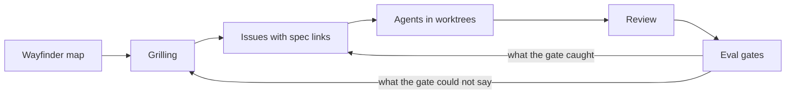

# How it was built

Tramitico was built by one person and a set of coding agents between 2026-07-21 and
2026-09-14: 161 merged pull requests, 163 closed issues, 21 architecture decision records,
and one eval harness that decided what could ship. This is the account of the workflow,
stage by stage, with one thing each stage caught that the previous one had let through. I
wrote it because BRIEF §3 said the process had to be visible, and because the parts that
went wrong are the parts an interviewer should ask about.

## The loop

Every stage exists because the one before it could not answer a question the build was about
to ask. The map settled what to build; grilling settled how; issues turned decisions into
acceptance criteria; agents wrote the code; review read it; the eval gates measured whether it
did what the issue claimed. When a gate failed, the failure became a new issue. When a gate
passed something it should not have, that was a grilling question.

## 1. The wayfinder map

The map is a GitHub issue, not a metaphor. [#1](https://github.com/rjwrld/tramitico/issues/1)
held three sections, notes, decisions so far, and fog, with child issues as tickets labelled
research, prototype, grilling or task, linked as native sub-issues, and blocked-by edges as
GitHub dependencies. The frontier query was mechanical: open children with no open blocker
and no assignee, first in map order. Resolving a ticket meant commenting the answer, closing
it, and appending the decision to the map. The rules are in
[`docs/agents/issue-tracker.md`](agents/issue-tracker.md).

The map's destination was [SPEC.md](../SPEC.md), whose first line still says so, and whose
locked-decisions table maps each decision to the ticket that made it. A second map,
[#254](https://github.com/rjwrld/tramitico/issues/254), ran in late August when the first
map's product boundary turned out to be wrong.

**What it caught:** that the product was not for developers. The brief said "independent
developers"; the map's audience ticket ended with "independent workers as natural persons,
developers the first cohort, not the boundary", and killed the metric the map had started
with: there is no target document count, only a coverage matrix. That reframing became
[ADR 0015](adr/0015-coverage-tiers-and-required-claims.md), the tier and required-claim
contract every later number is measured against.

## 2. Grilling

A grilling session is an interview the agent runs against me: every decision that hangs off
a plan, asked as a numbered question with a recommended answer, in rounds, until nothing is
left assumed. The answers are appended to the issue as a decision record. Most sessions took
the recommendation. The ones worth reading are the ones that did not.

**What it caught:** [#121](https://github.com/rjwrld/tramitico/issues/121), the release-risk
grill of 2026-08-12, records two reversals of the session's own recommendation. It
recommended single-turn Q&A; I chose multi-turn, on the condition that it be built as
question condensation, so retrieval, groundedness and adequacy keep operating on one
self-contained question ([ADR 0012](adr/0012-multi-turn-question-condensation.md)). It
recommended deferring the middleware-to-proxy migration; I moved it before launch. The same
session removed a spec default: there is no ingestion HTTP route, because an
internet-reachable service-role write path was a risk the grill could name and no feature
needed ([ADR 0010](adr/0010-cli-ingestion-authoritative.md)). Earlier,
[#10](https://github.com/rjwrld/tramitico/issues/10) reversed "gate everything" to "public
ask, sign in for history", which is why the demo works with zero friction.

## 3. Issues with spec links

Every issue opens with a `Spec:` line linking the SPEC section it implements, a context, and
an acceptance section written as a test the closing pull request has to pass. Triage uses
five labels, and an issue is `ready-for-agent` only when its acceptance can be checked without
asking me.

**What it caught:** [#130](https://github.com/rjwrld/tramitico/issues/130) predicted a gap
before it was measurable. Its acceptance read: the «¿Cuánto pago?» case passes adequacy with
the rates present; removing the rates from the answer fails the gate. When
[#278](https://github.com/rjwrld/tramitico/pull/278) built the adequacy judges, it opened by
naming that sentence, and the first real run ([#267](https://github.com/rjwrld/tramitico/issues/267))
showed why it mattered: groundedness passed 70 of 73 answers while Tier 1 adequacy was 2 of 27. Supported and incomplete are different failures, and until #130 only one of them had a
gate.

## 4. Agents in worktrees

Each issue was built by a coding agent in its own Orca worktree off `main`, several at a time.
[CLAUDE.md](../CLAUDE.md) is the map those agents read: where things are, which test lane a
suite belongs to, what must stay true. The worktrees shared one local Supabase stack, which
is the setup that produced the lesson.

**What it caught:** [#279](https://github.com/rjwrld/tramitico/issues/279). An integration
suite seeded one fixture chunk, ran retrieval with a dead embedder, and asserted the fixture
came back. On CI's empty database it did. On the shared stack carrying 871 real chunks, the
fixture's CCSS vocabulary lost to real CCSS articles and the assertion returned nothing. The
fix was a rule, now in CLAUDE.md: an integration suite must pass against a database holding
more than its own fixtures, so a retrieval fixture needs a word no real document contains.

The expensive lesson was cheaper to state than to learn. `eval/transcripts/` is gitignored
and worktree-local, and on 2026-09-08 the three full-run transcripts behind
[#304](https://github.com/rjwrld/tramitico/issues/304), about US$30 of provider spend,
were removed with the worktree that produced them. `eval/README.md` still cites them by
name. The rule now says: copy transcripts to the main checkout before a worktree is removed,
and a filename in a README is not a promise the file is on disk.

## 5. Review

Every pull request was reviewed by CodeRabbit and by me before a squash merge on green CI.
Review is a dialogue: findings are addressed, or declined with a pinned rationale, and the
pull request description says which.

**What it caught:** a green number for a feature that never ran.
[#298](https://github.com/rjwrld/tramitico/pull/298) added the expansion legs and read the
expansion model from the environment with `??`. The eval workflow passes repository
variables through `${{ vars.X }}`, which interpolates an unset variable as the empty string,
not as undefined. An eval run would have sent the provider an empty model name, the expansion
call would have swallowed the error and returned null, and the transcript would have printed
`expand=on` over a run that never expanded anything. Three of that review's seven findings
were real defects; that one was live. [#294](https://github.com/rjwrld/tramitico/pull/294)
caught the eval transcript dropping chunk content, which is the one field a transcript exists
to carry, and two runs in the same second overwriting each other.

## 6. Eval gates

`pnpm test:eval` runs 73 hand-written cases through the production pipeline and judges every
answer with a second model at temperature 0. Four gates decide a release: retrieval hit-rate,
groundedness, adequacy, abstention. Thresholds ratchet: a gate is set at the measured rate
minus one case, rounded down, and never lowered to meet a number. Every run is written up in
[`eval/README.md`](../eval/README.md), including the ones that were the provider's fault.

**What it caught:** [#312](https://github.com/rjwrld/tramitico/issues/312). The derived
figure for the CCSS minimum contribution base needs two inputs, and one of them, the
minimum-wage decree, never reached the fused pool in any configuration: rank 97 with the
step catalogue off, 72 with it on, against a pool of 40. Three full runs showed the same
result. No prompt change could fix it, and the gate said so before anyone tuned a prompt.

**What it could not say:** [#324](https://github.com/rjwrld/tramitico/issues/324). SPEC §9
had said since 2026-09-04 that no individually blocking case may fail groundedness. The
hit-rate lane asserted it per case from the start. The groundedness lane asserted only the
aggregate. Two Tier 1 answers in the closing run were wrong statements, an export case read
as taxable on a phrase that does not settle it, and 11,66 % given as a category's rate where
the table says 9,91 %, and the gate passed at 70 of 73. The accepted-risk record had described
Tier 1 answers as incomplete but never wrong. #324 corrected the sentence, named the two cases
with an owner and an expiry, and added the per-case assertion, which will fail on the next paid
run while those cases still fail. That is what the gate should say; the deploy decision lives
in the risk record, not in the gate.

## What the models were not asked to do

Two places where the obvious LLM solution was measured and rejected. In
[#303](https://github.com/rjwrld/tramitico/issues/303), the requirements Tier 1 answers
missed were steps the question never asks for: where to enrol requires when to pay. A "next
step" probe written by Haiku either rewrote the question again or copied the prompt's worked
example verbatim. The steps are not open-ended, so they were written by hand, per family, and
searched as one more retrieval leg ([ADR 0020](adr/0020-step-catalogue-legs.md)). And figures
that no single document states are computed by code from cited inputs, never by the model
([ADR 0018](adr/0018-derived-figures-by-code.md)), because a number the model derives is a
number the citation check cannot verify.

## What it cost

A full eval run costs about US$6 in provider spend, and the closing run of 2026-09-11 cost
US$6.20 plus US$0.75 for three hit-rate readings, one of which bought only the diagnosis that
the account balance had reached zero mid-session. The runs behind the README's tables cost on
the order of US$30 in total, and the three lost transcripts about the same again. The lesson
in the eval README is short: verify the balance before a paid run, and read a run that logs
provider errors as a run to repeat, not a number.
